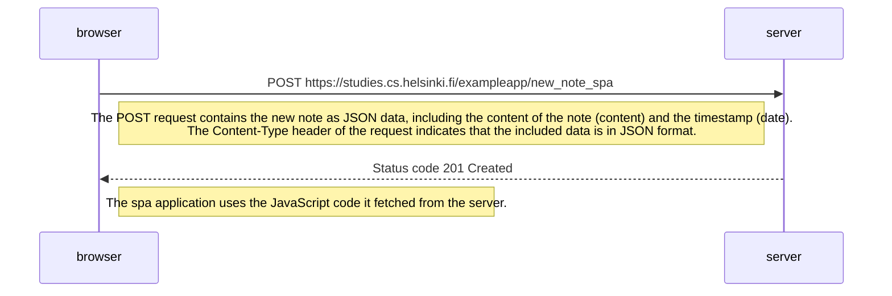

This is a flow chart built in Mermaid. It represents the flow when the user makes a new note on the website https://studies.cs.helsinki.fi/exampleapp/notes."

```mermaid
sequenceDiagram
    participant browser
    participant server

    browser->>server: POST https://studies.cs.helsinki.fi/exampleapp/new_note_spa
    Note right of browser: The POST request contains the new note as JSON data, including the content of the note (content) and the timestamp (date). <br/> The Content-Type header of the request indicates that the included data is in JSON format.

    server-->>browser: Status code 201 Created
    Note right of browser: The spa application uses the JavaScript code it fetched from the server.

```    
